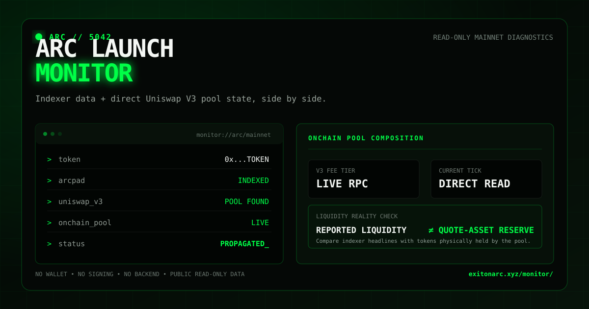

# Arc Launch Monitor

**Read-only diagnostics for new token markets on Arc.**

Arc Launch Monitor compares what third-party services report about an Arc token with what its Uniswap V3 pool actually holds onchain.

[**Live demo →**](https://exitonarc.xyz/monitor/) · [**Project site →**](https://exitonarc.xyz) · [**X →**](https://x.com/EXITARC)



> **Indexer headlines tell you what a service sees. Arc Launch Monitor adds direct onchain pool state so you can see what is actually there.**

---

## Why this exists

Arc Launch Monitor started from a real mainnet edge case.

A newly launched Arc token showed roughly **$2.9K of headline liquidity** on DexScreener, while another discovery platform reported only about **$9 of liquidity**.

Both readings were pointing at something real.

Direct onchain reads showed that the concentrated Uniswap V3 pool was heavily one-sided: it held almost the entire token inventory, but only about **$9 of USDC** at that moment.

That exposed a useful distinction:

> **Headline liquidity is not always the same thing as immediately available quote-asset reserves.**

Arc Launch Monitor makes that difference visible.

---

## What it checks

Paste an Arc token contract address and the monitor compares several sources.

### ArcPad

- token name and symbol
- ArcPad launch metadata
- pool address
- current ArcPad price
- reported market cap

### DexScreener

- Arc pair discovery
- reported liquidity
- 24h volume
- market cap / FDV
- 24h transaction count
- pair link

### Arc mainnet JSON-RPC

When a compatible Uniswap V3 pool is resolved, the monitor reads the pool directly from Arc and displays:

- `token0`
- `token1`
- V3 fee tier
- current tick from `slot0()`
- active liquidity parameter
- live ERC-20 balances held by the pool contract
- USDC reserve when Arc USDC is one side of the pair
- estimated pool composition
- one-sided-liquidity warnings

### Fomo

Fomo is currently treated as a manual external check because the monitor does not rely on a public Fomo API.

---

## The important distinction

A concentrated-liquidity pool can contain a large amount of token inventory while holding very little of the quote asset.

For example, during the original `$EXIT` investigation, the pool held approximately:

```text
~996.9M EXIT
~9.1 USDC
```

At the prevailing token price, the EXIT inventory could be valued in the thousands of dollars even though the pool only held about nine USDC at that moment.

A market-data service can therefore display a much larger headline liquidity figure than the amount of USDC physically held by the pool.

Arc Launch Monitor shows both values instead of treating them as interchangeable.

### Important caveat

The USDC balance is **not** a guaranteed executable sell amount.

Actual swap execution still depends on:

- the current V3 tick
- active liquidity ranges
- pool fees
- routing
- slippage
- other pools or routes that may exist

The monitor is a diagnostic snapshot, not a trading quote.

---

## How it works

The app is intentionally lightweight.

```text
Browser
  |
  |-- ArcPad public API
  |
  |-- DexScreener public API
  |
  `-- Arc mainnet JSON-RPC
          |
          |-- Uniswap V3 pool reads
          |    |-- token0()
          |    |-- token1()
          |    |-- fee()
          |    |-- liquidity()
          |    `-- slot0()
          |
          `-- ERC-20 balanceOf(pool)
```

There is currently:

- no wallet connection
- no transaction signing
- no backend database
- no private API key
- no trading functionality

All blockchain calls are read-only.

---

## Tech stack

- HTML
- CSS
- vanilla JavaScript
- GitHub Pages
- Arc mainnet
- JSON-RPC `eth_call`
- ArcPad public API
- DexScreener public API
- Uniswap V3 pool interfaces

No framework or build step is required.

---

## Project structure

```text
/
├── assets/
│   └── arc-launch-monitor-preview.svg
├── index.html              # Exit Liquidity project site
├── styles.css
├── script.js
├── logo.svg
├── README.md
└── monitor/
    ├── index.html          # Arc Launch Monitor UI
    ├── monitor.css         # base monitor styling
    ├── monitor.js          # ArcPad + DexScreener discovery
    ├── onchain.css         # onchain diagnostics styling
    └── onchain.js          # Arc RPC + Uniswap V3 reads
```

---

## Try it

Open:

**https://exitonarc.xyz/monitor/**

The `$EXIT` contract is loaded as the default real-world demo:

```text
0x1b556933D64AE9bb32044711C5393B2E5663d185
```

The monitor also accepts other Arc token contracts. Support depends on whether ArcPad and/or DexScreener can resolve a compatible market pool.

You can share a specific check using the query parameter:

```text
https://exitonarc.xyz/monitor/?token=0x...
```

---

## Known limitations

This is an early mainnet tool.

- ArcPad and DexScreener can index new tokens at different times.
- Public APIs can temporarily fail or rate-limit requests.
- Not every Arc token launches through ArcPad.
- Not every market uses Uniswap V3.
- Token decimals and metadata can vary.
- A raw pool token balance does not by itself describe executable depth.
- The monitor currently focuses on ArcPad-discovered or DexScreener-discovered Uniswap V3-style markets.
- Fomo status is manual until a suitable public integration exists.

When a source cannot be checked reliably, the UI is designed to show **check incomplete / retry** instead of turning an upstream failure into a false negative.

---

## Roadmap

Potential next steps:

- support additional Arc DEXs and pool types
- show estimated buy-side and sell-side depth at multiple trade sizes
- compare pool composition over time
- detect multiple pools for the same token
- add richer token metadata and decimals discovery
- add clearer V3 range visualization
- expose a compact shareable diagnostics report
- add automated tests for RPC decoding and pool math

---

## Relationship to Exit Liquidity

Arc Launch Monitor was built while launching and debugging **Exit Liquidity (`$EXIT`)**, an independent community token on Arc.

The token became the first real-world test case for the monitor after different ecosystem tools reported dramatically different liquidity numbers for the same market.

The monitor is intended to be useful beyond `$EXIT` and is designed to accept arbitrary Arc token contract addresses where compatible market data is available.

Project site: https://exitonarc.xyz

X: https://x.com/EXITARC

---

## Safety and disclaimer

Arc Launch Monitor is an informational developer experiment.

It does not provide investment advice, guarantee liquidity, guarantee trade execution, or verify that a token is safe.

Always verify contract addresses and independently inspect market conditions before interacting with any token.

This project is independent and is not affiliated with or endorsed by Arc, Circle, ArcPad, Uniswap, DexScreener, Fomo, or any similarly named project.

---

## Status

**Live on Arc mainnet.**

Current focus: improving diagnostics around concentrated-liquidity markets and the difference between reported liquidity and live quote-asset reserves.
